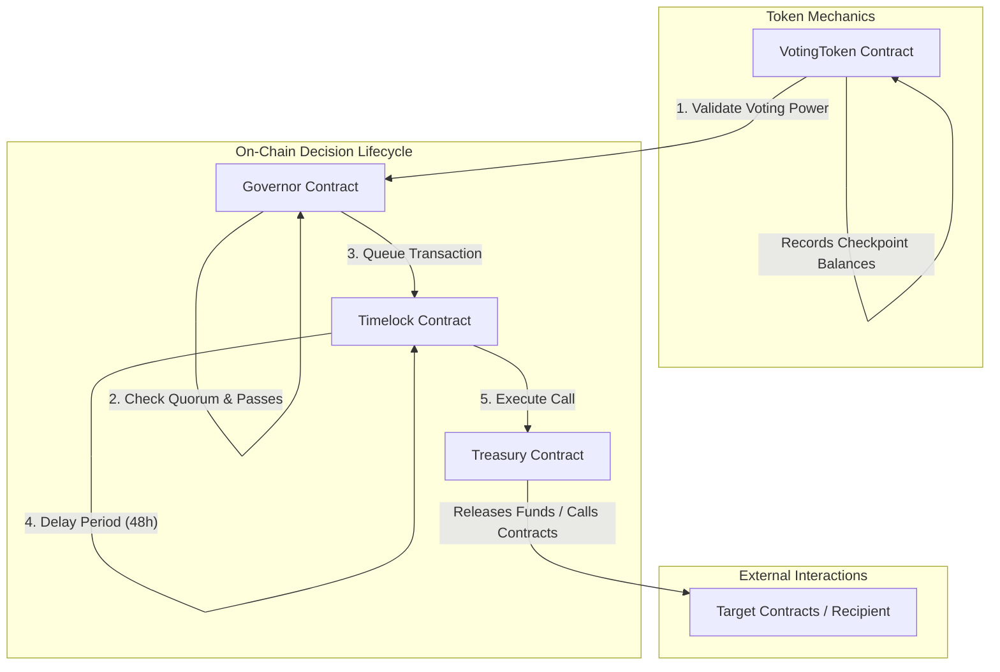

# StellarGov Contracts: Core Governance & Treasury Logic

[](https://www.drips.network/wave)
[](https://www.rust-lang.org/)
[](https://opensource.org/licenses/Apache-2.0)

**The on-chain heart of the StellarGov governance suite. Secure, modular Soroban smart contracts implementing checkpoints, timelocks, and treasury custody.**

---

# 🗳️ Technical Overview

`stellargov-contracts` brings reliable, Compound-grade decentralized governance to the Stellar Network. Built natively on the **Soroban Smart Contract platform** using Rust, these contracts are designed to enforce transparent, on-chain parameters for proposals, voting, timelocks, and decentralized asset custody.

### Core Contracts:
1.  **`VotingToken`:** A token wrapper that records voting power checkpoints. Every transfer updates a checkpoint list, letting the Governor query historical voting balances at a specific past ledger block, completely preventing double-voting attacks.
2.  **`Governor`:** Enforces the proposal lifecycle (submission, voting delay, voting, queueing, execution). Manages parameters such as voting delay, voting period, proposal threshold, and quorum.
3.  **`Timelock`:** A decentralized queue contract that holds passed proposals for a configured execution delay (e.g., 48 hours). This acts as a vital security buffer, allowing community members to withdraw or react before changes are executed on-chain.
4.  **`Treasury`:** The decentralized vault that stores DAO funds. It is cryptographically configured to only execute state mutations and payouts initiated by the verified `Timelock` contract.

---

# 🏗️ Internal Architecture



---

# 📋 Governance Parameter Configuration

The `Governor` contract exposes highly configurable parameters to fit institutional and community needs:

| Parameter | Type | Default Value | Description |
| :--- | :--- | :--- | :--- |
| **`voting_delay`** | `u32` (Ledgers) | `17,280` (~24 hours) | Number of ledgers between proposal submission and voting opening. |
| **`voting_period`** | `u32` (Ledgers) | `51,840` (~3 days) | Length of time (in ledgers) that voting remains open. |
| **`proposal_threshold`**| `i128` (Tokens)  | `10,000 VT` | Minimum voting power required to submit a proposal. |
| **`quorum_votes`** | `i128` (Tokens)  | `100,000 VT` (10%) | Minimum number of "For" votes required for a proposal to pass. |
| **`timelock_delay`** | `u64` (Seconds)  | `172,800` (48 hours)| Required execution delay enforced by the Timelock contract. |

---

# 📂 Repository Structure

```text
stellargov-contracts/
├── contracts/
│   ├── governor/         # Proposal lifecycle, quorum, and voting checks
│   ├── timelock/         # Queue execution delays and admin functions
│   ├── treasury/         # Vault asset storage and execution controls
│   └── voting_token/     # Checkpoint-based token ledger logic
├── Cargo.toml            # Workspace manifest and dependencies
└── README.md             # You are here
```

---

# 🛠️ Development & Contributing

We welcome security audits and community contributions. Please ensure all code additions maintain 100% test coverage.

### Local Setup
1. **Clone the Repo:** `git clone https://github.com/stellargov-phantom/stellargov-contracts.git`
2. **Build Workspace:** `cargo build --target wasm32-unknown-unknown --release`
3. **Run Unit Tests:** `cargo test`

---

# 📄 License

This project is licensed under the **Apache License 2.0**.
